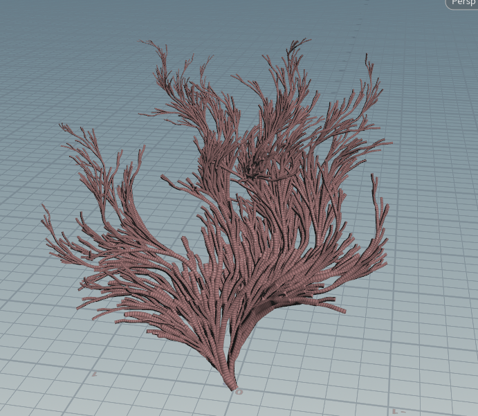
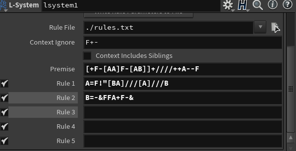

Di Lu: L Systems Trees
=====================================

For this project, we implemented a WebGL scene which uses L Systems grammar to generate structures that appear natural. 
I implemented an underwater anemone or coral-like structure that I discovered after fiddling around in Houdini. Initially, this was
the appearance in Houdini:

Design?
=================

I broke down the L-system into 2 parts: Parser and Renderer. The parser is only responsible for expanding the grammar string, and the renderer is only responsible for drawing while traversing the completely expanded grammar string. This was both in order to make the debugging process easier, but also due to the fact that drawing should only be occurring at the very end.

L Systems Parser: 

- Axiom
- map<Chars, ExpansionRule>
- currentString = at the beginning, axiom
- constructor()
- parseRecursive(currDepth: int)
- resetString() -> unused but thought it might be useful

ExpansionRule: 

- map<likelihood number, string expansion>
- constructor()
- getExpansion() -> picks one of the values from the map based on likelihood threshold

Approach: Make sure parser works by using console.log to show string

L Systems Renderer

- expandedGrammar
- turtleStack
- transformList -> list of DrawingRules
- angle
- systemOrigin
- segLength
- traverseGrammar()

DrawingRule
- shape
- transform

I tried to replicate the grammar from Houdini by using the following rules: 

Axiom: D[[AA]-[AB]]+////++A--

Rule1: A = F[BA]/F//[AB]/F//B

Rule2: B = -F&A+&C

Rule3: F = F

